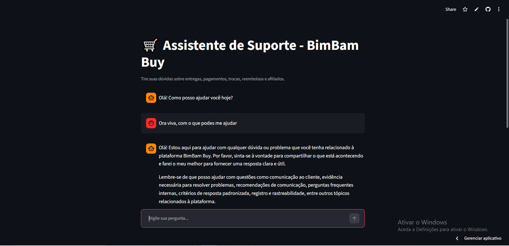

# 🛒 Assistente Virtual RAG - BimBam Buy

> 🚀 **Aplicação Online:** [Acessar o Assistente BimBam Buy](https://agentebumbambuyrag-zx5zjfws2vhmmgqgpzpezo.streamlit.app/)

Este projeto é um agente inteligente de suporte baseado em **RAG (Retrieval-Augmented Generation)** desenvolvido para responder dúvidas de clientes sobre **entregas, frete, pagamentos, trocas, reembolsos e programa de afiliados** da plataforma **BimBam Buy**.

---

### 📸 Demonstração da Interface



---

## ℹ️ Sobre o Projeto

A solução utiliza técnicas modernas de recuperação de informação e modelos de linguagem de grande porte (LLMs) para fornecer respostas precisas e contextualizadas, alimentadas estritamente pelas políticas internas em PDF da loja.

O projeto oferece duas formas de interação:
1. **Interface Web Interativa (`app.py`)**: Desenvolvida com Streamlit para uso em navegador.
2. **Interface via Terminal (`main.py`)**: Execução rápida direta no console.

---

## 🛠️ Tecnologias Utilizadas

- **Linguagem de Programação:** Python 3.10+
- **Interface Web:** [Streamlit](https://streamlit.io/)
- **Orquestração RAG:** [LangChain](https://www.langchain.com/) (sintaxe LCEL)
- **Modelo de Linguagem (LLM):** `llama-3.3-70b-versatile` (via [Groq API](https://groq.com/))
- **Embeddings:** `all-MiniLM-L6-v2` (via `HuggingFaceEmbeddings`)
- **Banco de Dados Vetorial:** [Chroma DB](https://www.trychroma.com/)
- **Leitura Multi-Documentos:** `DirectoryLoader` + `PyPDFLoader` + `RecursiveCharacterTextSplitter`

---

## 🏗️ Arquitetura da Solução

```text
[ Pasta ./documentos/*.pdf ] ──> [ DirectoryLoader ] ──> [ Text Splitter ]
                                                                │
                                                                ▼
                                                   [ HuggingFace Embeddings ]
                                                                │
                                                                ▼
[ Usuário (Streamlit ou Terminal) ] ──> [ Retriever (MMR, k=5) ] ──> [ Chroma DB ]
                │                                     │
                ▼                                     ▼
       [ Prompt Template ] ──────────────> [ Groq / Llama 3.3 ] ──> [ Resposta ]

       🚀 Como Executar o ProjetoPré-requisitosPython instalado (versão 3.10 ou superior)Chave de API da GroqPasso a PassoClonar o repositório:Bashgit clone [https://github.com/emanuelP505/AGENTE_BUMBAM_BUY_RAG.git](https://github.com/emanuelP505/AGENTE_BUMBAM_BUY_RAG.git)
cd AGENTE_BUMBAM_BUY_RAG
Criar e ativar o ambiente virtual
No Windows (PowerShell):PowerShell
python -m venv .venv
.\.venv\Scripts\Activate.ps1
Linux / Mac:
python3 -m venv .venv
source .venv/bin/activate


Instalar as dependências:
python -m pip install -r requirements.txt
Configurar as variáveis de ambiente:Crie um arquivo .env na raiz do projeto contendo a sua chave da Groq:Fragmento do código
GROQ_API_KEY=sua_chave_groq_aqui
Organizar os Documentos:
Certifique-se de que a pasta documentos existe na raiz do projeto e contém os PDFs das políticas do BimBam Buy.

🖥️ Modo de Execução

Você pode rodar a aplicação de duas maneiras:

Opção A: Interface Web (Streamlit) — Recomendado
python -m streamlit run app.py
Abre automaticamente no navegador no endereço http://localhost:8501 (ou acesse a versão em produção).

Opção B: Interface via Terminal
python main.py

Executa o chat interativo diretamente na linha de comando.

💬 Exemplo de Uso
Usuário: Qual o limite para ter frete grátis na loja?
Assistente BimBam Buy: De acordo com a nossa Política de Envios, o frete é gratuito para compras acima de R$ 199,00 para todo o Brasil.